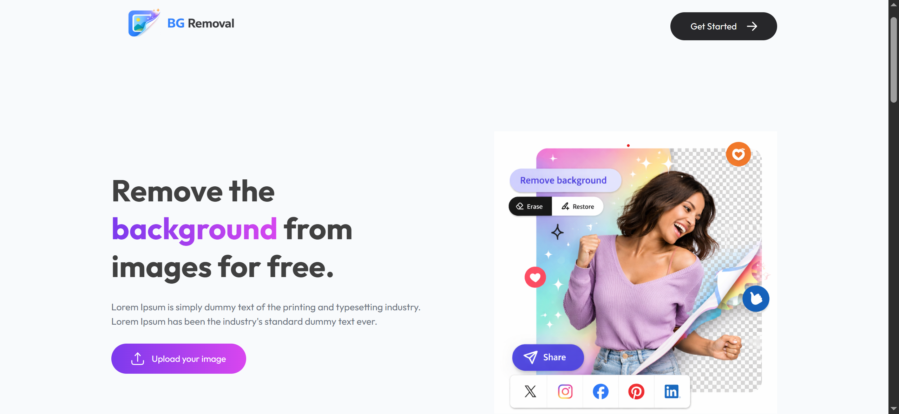
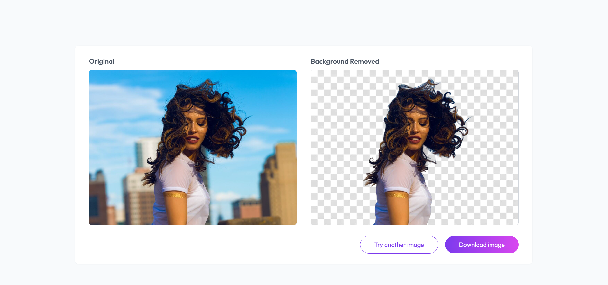
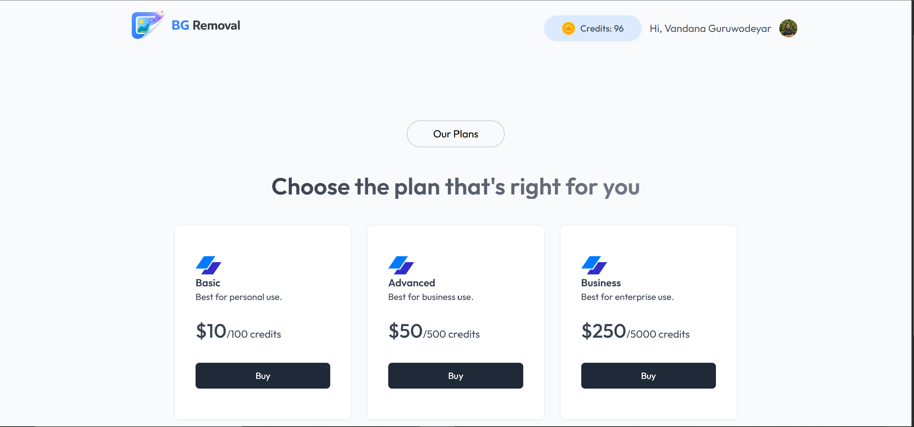

🖼️ AI Background Remover with Credit & Payment System

A full-stack SaaS-style web application where users can remove image backgrounds using AI, manage usage via a credit system, and purchase additional credits through Razorpay.

🚀 Live Demo

🔗https://bg-removal-iota-gold.vercel.app/

⚡ Key Highlights

* 🔐 Authentication using Clerk (secure user sessions)
* 🧠 AI-powered background removal (ClipDrop API)
* 💳 Credit-based usage system (real-world SaaS model)
* 💰 Razorpay payment integration (end-to-end flow)
* 🔄 Real-time credit updates after payment verification
* ⚙️ Full backend logic for transactions & validation

🛠️ Tech Stack

* **Frontend:** React (Vite), Tailwind CSS
* **Backend:** Node.js, Express
* **Database:** MongoDB
* **Auth:** Clerk
* **Payments:** Razorpay
* **AI API:** ClipDrop

🔄 How It Works

1. User signs in via Clerk
2. Uploads an image
3. Background is removed using AI
4. Credits are deducted
5. If credits are insufficient → user purchases credits
6. Payment is verified → credits updated securely

## 🧠 What Makes This Project Strong

* Implements a **real-world monetization system**
* Handles **payment verification & race conditions**
* Uses **token-based authentication with middleware**
* Maintains **transaction consistency in database**
* Full-stack integration of **AI + payments + auth**

📸 Screenshots

Home Page

Result Page

Payment Flow

📌 Future Improvements

* Subscription plans
* Image history dashboard
* Performance optimization

👩‍💻 Author
Vandana
GitHub: https://github.com/fushiguro-3
LinkedIn: https://www.linkedin.com/in/sahavandana/

⭐ If you found this interesting, feel free to star the repo!
